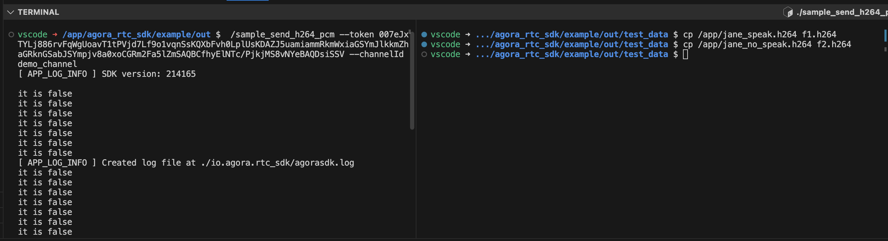

Start docker

```
docker-compose up
```
Can also use dev container in vscode

Go to demo (java_app) container
```
docker compose exec java_app bash
```

There are 2 sample codes. One is for Java, and one is for C++.

### 1. Java app demo

Execute as below to run the example in java

```
./run.sh
```

### 2. C++ app demo

Follow steps in the this site to build and download the test_data (no need to download the sdk anymore since it was already in the docker)  
https://docs.agora.io/en/server-gateway/get-started/integrate-sdk?platform=linux-cpp

After build the example and download the test_data, execute the below example file.  

```
/app/agora_rtc_sdk/example/out $ ./sample_send_h264_pcm --token YOUR_TOKEN --channelId demo_channel
```

The `/app/agora_rtc_sdk/example/h264_pcm/sample_receive_h264_pcm.cpp` has been modified to watch new h264 file is created for streaming.
In another bash, copy files needed for streaming to the test_data folder

```
vscode ➜ .../agora_rtc_sdk/example/out/test_data $ cp /app/jane_speak.h264 f1.h264
vscode ➜ .../agora_rtc_sdk/example/out/test_data $ cp /app/jane_no_speak.h264 f2.h264
```


